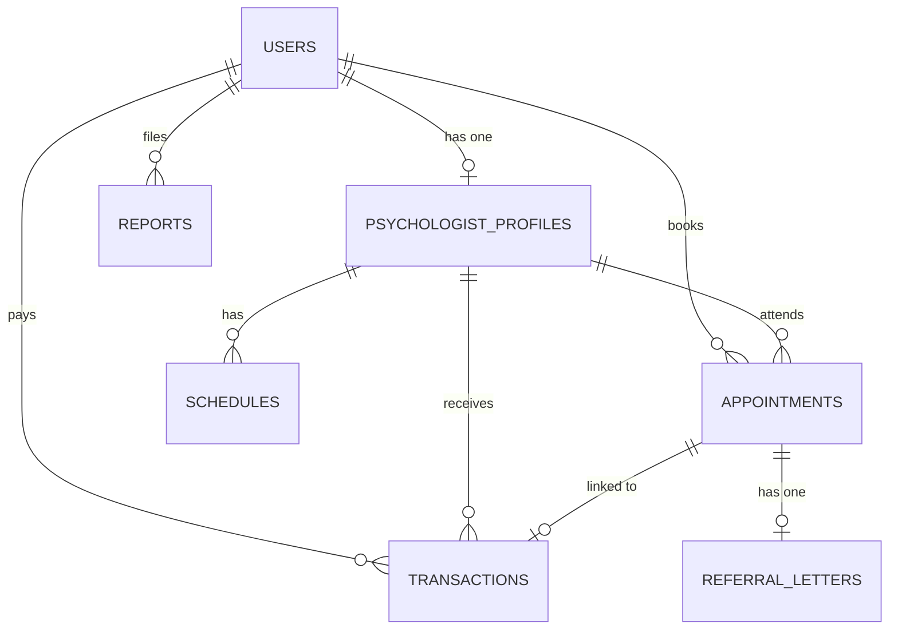

# Deskripsi Sistem & Struktur Kode "Psikologku"

**Psikologku** adalah sebuah platform berbasis web yang dirancang untuk menghubungkan pasien (pengguna umum) dengan psikolog profesional. Sistem ini memungkinkan pengguna untuk mencari terapis/psikolog, menjadwalkan konsultasi, melakukan pembayaran secara online, mengadakan sesi konseling, serta mengelola catatan medis psikologis (rekam medis konseling) dan surat rujukan.

---

## 1. Arsitektur & Teknologi Utama (Tech Stack)

Sistem ini dibangun menggunakan arsitektur modern berkinerja tinggi yang menggabungkan backend Laravel dengan frontend Single-Page Application (SPA) menggunakan React tanpa kompleksitas API terpisah.

### Backend (PHP 8.4 & Laravel 13)
*   **Laravel Framework (v13.x):** Sebagai fondasi utama backend aplikasi.
*   **Laravel Fortify:** Menyediakan sistem otentikasi tanpa kepala (headless) untuk login, registrasi, pembaruan profil, manajemen kata sandi, serta Otentikasi Dua Faktor (2FA/TOTP).
*   **Laravel Socialite:** Digunakan untuk integrasi otentikasi pihak ketiga melalui Google OAuth (`google-id`).
*   **Filament PHP (v5.x):** Panel administrasi back-office yang canggih untuk mengelola pengguna, verifikasi psikolog, transaksi keuangan, serta laporan pengaduan pelanggan.
*   **Spatie Laravel Permission & Filament Shield:** Sistem kontrol akses berbasis peran (Role-Based Access Control / RBAC) untuk memisahkan hak akses antara `admin`, `psychologist`, dan `user` (pasien).
*   **Laravel Wayfinder:** Menghubungkan routing Laravel dengan frontend dengan menghasilkan fungsi TypeScript secara otomatis dari rute backend.
*   **Midtrans PHP SDK:** Integrasi gerbang pembayaran (payment gateway) lokal Indonesia untuk memproses transaksi dengan Snap Token (popup pembayaran) dan pembaruan status transaksi otomatis via callback webhook.

### Frontend (React 19 & Inertia.js v3)
*   **React 19:** Pustaka antarmuka pengguna berbasis komponen deklaratif.
*   **Inertia.js (v3.x - React adapter):** Menghubungkan Laravel dan React secara langsung. Halaman dirender di sisi klien (client-side SPA) menggunakan data properti (props) yang dikirim dari controller Laravel, sehingga meniadakan kebutuhan untuk membuat REST API terpisah.
*   **Tailwind CSS (v4.0):** Framework CSS utilitas terbaru untuk penataan gaya yang cepat, efisien, dan responsif. Diintegrasikan langsung ke build pipeline melalui `@tailwindcss/vite`.
*   **Radix UI & Lucide React:** Komponen primitif tanpa gaya (headless UI) yang ramah aksesibilitas (accessibility-first) dipadukan dengan pustaka ikon Lucide.
*   **TypeScript:** Memberikan keamanan tipe data (type-safety) di seluruh kode frontend.

---

## 2. Struktur Direktori Utama

Berikut adalah penjelasan fungsi setiap direktori utama dalam proyek ini:

```text
psikologku/
├── app/                      # Logika utama aplikasi (Backend Laravel)
│   ├── Actions/              # Aksi otentikasi kustom (Fortify: registrasi, reset password)
│   ├── Filament/             # Konfigurasi, Sumber daya (Resources), dan Halaman Panel Admin Filament
│   ├── Http/                 # Lapisan HTTP (Controllers, Middleware, Requests)
│   │   ├── Controllers/      # Controller untuk alur bisnis (Pembayaran, Jadwal, Catatan, dll.)
│   │   └── Middleware/       # Filter keamanan dan otentikasi rute
│   ├── Models/               # Representasi tabel basis data (Eloquent Models & Relasi)
│   ├── Notifications/        # Kelas Notifikasi sistem (database, email, dll.)
│   ├── Providers/            # Service Providers penyedia layanan Laravel
│   └── Services/             # Integrasi pihak ketiga (misalnya: MidtransSnap)
├── config/                   # File konfigurasi global aplikasi Laravel
├── database/                 # Berkas migrasi skema dan data awal (seeding)
│   ├── migrations/           # Skema tabel database
│   └── seeders/              # Seeder untuk data bawaan/tes awal
├── resources/                # Aset frontend (React, CSS, Gambar)
│   ├── css/                  # File CSS utama (mengimpor Tailwind v4)
│   └── js/                   # Logika Frontend React
│       ├── actions/          # Kode fungsi aksi yang dihasilkan oleh Wayfinder
│       ├── components/       # Komponen UI modular (UI Primitives & Modal Khusus)
│       ├── layouts/          # Layout halaman (AppLayout, AuthLayout, SettingsLayout)
│       ├── pages/            # Komponen halaman utama Inertia.js (welcome, dashboard, dll.)
│       └── routes/           # Definisi rute tipe-aman yang dihasilkan Wayfinder
├── routes/                   # File routing Laravel (web.php, api.php, settings.php)
├── tests/                    # Berkas pengujian unit dan fitur menggunakan Pest PHP
├── vite.config.ts            # Konfigurasi bundler Vite (plugin React, Inertia, Wayfinder)
└── tsconfig.json             # Konfigurasi kompiler TypeScript
```

---

## 3. Skema Basis Data (Database Schema)

Sistem ini didukung oleh database relasional dengan tabel-tabel utama sebagai berikut:



### Tabel Utama & Relasi:

1.  **`users`**
    *   Menyimpan data identitas semua aktor (admin, psikolog, dan pasien).
    *   Kolom penting: `name`, `email`, `password`, `phone`, `birthdate`, `gender`, `birthplace`, `address`, `google_id` (Google OAuth), `two_factor_secret` (TOTP 2FA).
2.  **`psychologist_profiles`**
    *   Informasi khusus bagi pengguna yang berperan sebagai Psikolog.
    *   Kolom penting: `user_id` (relasi ke `users`), `profession` (spesialisasi profesi), `str_number`, `sipp` & `sippk` (nomor lisensi praktek resmi), `specialization` (array tag JSON), `price` (tarif konsultasi), `signature_path` (tanda tangan digital untuk surat rujukan), `photo_url`, `is_online`.
3.  **`schedules`**
    *   Jadwal ketersediaan konsultasi yang dibuat oleh psikolog.
    *   Kolom penting: `psychologist_id`, `day_of_week` (hari ketersediaan), `start_time`, `end_time`, `is_active` (status keaktifan jadwal).
4.  **`appointments`**
    *   Sesi janji temu konsultasi antara pasien dan psikolog.
    *   Kolom penting: `user_id`, `psychologist_id`, `schedule_id`, `transaction_id`, `appointment_date`, `start_time`, `end_time`, `status` (pending, confirmed, ongoing, completed, cancelled).
    *   *Catatan Medis Konseling:* Kolom rekam medis seperti `complaint`, `patient_state` (JSON status emosi/fisik), `diagnosis`, `action_taken`, `structured_recommendations` (JSON saran terstruktur).
    *   *Ulasan Pasien:* `rating` dan `review` untuk menilai performa layanan psikolog.
5.  **`transactions`**
    *   Catatan pembayaran konsultasi via Midtrans.
    *   Kolom penting: `user_id`, `psychologist_id`, `order_id` (ID transaksi unik), `gross_amount` (jumlah bayar), `status` (pending, settled, expire, failed), `snap_token` (token integrasi popup Midtrans).
6.  **`referral_letters`**
    *   Surat rujukan yang diterbitkan oleh psikolog jika pasien membutuhkan penanganan lebih lanjut (misal: ke psikiater/rumah sakit jiwa).
    *   Kolom penting: `appointment_id`, `addressed_to` (tujuan rujukan), `reason` (alasan rujukan).
7.  **`reports`**
    *   Pengaduan atau bantuan CS (Customer Service) yang diajukan oleh pengguna.
    *   Kolom penting: `user_id`, `title`, `content`, `photo_path`, `status` (open, in_progress, resolved).

---

## 4. Alur Kerja Utama Sistem (Core Workflows)

### A. Otentikasi dan Profiling
1.  **Registrasi & Google OAuth:** Pengguna baru dapat mendaftar menggunakan formulir email biasa (Fortify) atau menggunakan akun Google (Socialite).
2.  **Lengkapi Profil:** Sebelum melakukan transaksi atau booking, pengguna diwajibkan melengkapi biodata (no. telp, tanggal lahir, jenis kelamin, alamat) melalui `CompleteProfileController`.
3.  **Otentikasi Dua Faktor (2FA):** Pengguna dapat mengaktifkan proteksi ekstra berbasis aplikasi autentikator (Google Authenticator) menggunakan fitur Fortify TOTP.

### B. Alur Pendaftaran Psikolog & Verifikasi Admin
1.  Calon Psikolog mendaftar ke sistem.
2.  Mereka mengisi data lisensi profesional (`str_number`, `sipp`, `sippk`), mengunggah foto profil, tanda tangan digital, dan spesialisasi keahlian di halaman `psychologist-profile-setup.tsx`.
3.  Admin memverifikasi berkas dan lisensi psikolog melalui **Panel Admin Filament** sebelum memberikan peran (`role`) `psychologist` secara resmi.

### C. Booking Jadwal & Pembayaran (Midtrans Integration)
1.  Pasien mencari psikolog berdasarkan kriteria di halaman `therapists.tsx`.
2.  Pasien memilih jadwal konsultasi aktif yang tersedia dari tabel `schedules`.
3.  Sistem membuat data `Transaction` & `Appointment` berstatus `pending`, lalu memanggil API Midtrans via layanan `MidtransSnap` untuk mendapatkan `snap_token`.
4.  Di halaman `payment.tsx`, widget Midtrans Snap terbuka secara aman dalam bentuk modal popup. Pasien menyelesaikan pembayaran (Virtual Account, E-Wallet, Kartu Kredit).
5.  Midtrans mengirim callback ke `PaymentController@callback` setelah transaksi berhasil. Sistem mengubah status pembayaran menjadi `settled` dan status janji temu menjadi `confirmed`.

### D. Sesi Konsultasi & Pengisian Rekam Medis
1.  Pada hari yang dijadwalkan, psikolog memulai sesi konseling (`psychologist-appointments.tsx`).
2.  Setelah/selama sesi berlangsung, psikolog mengisi catatan konsultasi klinis (diagnosis, tindakan, rekomendasi terstruktur, keluhan pasien) menggunakan modal formulir `record-form-modal.tsx`.
3.  Jika pasien membutuhkan rujukan medis/klinis eksternal, psikolog dapat membuat surat rujukan melalui modal `referral-letter-modal.tsx`.
4.  Psikolog menandai sesi sebagai selesai (`completed`).
5.  Sistem secara otomatis membuat berkas ringkasan rekam medis dan surat rujukan dalam format PDF yang dapat diunduh oleh psikolog maupun pasien.

### E. Penilaian Ulasan & Layanan Pengaduan (CS)
1.  Setelah sesi selesai, pasien dapat memberikan bintang (`rating`) dan masukan tertulis (`review`) melalui halaman riwayat konsultasi (`records.tsx`).
2.  Jika ada kendala (misal: kendala teknis pembayaran, ketidakhadiran terapis), pengguna dapat mengirimkan aduan beserta unggahan bukti foto ke Customer Service (`customer-service.tsx`). Pengaduan ini langsung masuk ke panel administrasi Filament untuk segera ditindaklanjuti.

---

## 5. Pengembangan & Pengujian

*   **Pest PHP:** Pengujian fungsionalitas (Feature Tests) backend ditulis menggunakan kerangka Pest. Pengujian berfokus pada alur booking, verifikasi otentikasi, alur callback Midtrans, dan hak akses rute.
*   **Laravel Pint:** Digunakan untuk memformat gaya penulisan kode PHP agar sesuai dengan standar PSR-12/PER.
*   **ESLint & Prettier:** Menjaga kebersihan dan konsistensi kode JavaScript/TypeScript dan React.
